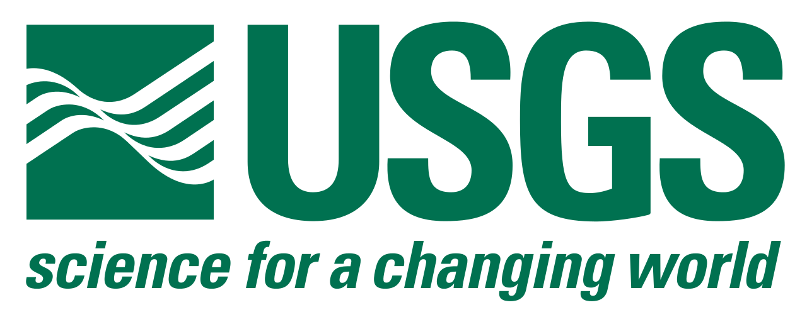

# PIPS: Planetary Image Processing Server
=====================================================================
### Introduction
---------------------------------------------------------------------
This is a server that is supported by ISIS3 on the backend, its purpose is to brings the 
power that ISIS has when processing a cube or tiff file to the click of a button.
Users can upload cube (.cub) or geotiff (.tif) files to the server and be returned 
useful data that relates to the contents of the image as well as the image itself.
The users will be able to edit a simple text caption and use the data that is found by ISIS
to write captions for the images inside the files. Using a tag format they can use data 
from the cubes on the fly just by copy and pasting the tags into the caption field.
This will fast track the figure making process for researchers around the world.

The other purpose is to allow for simple photo editing capaboilities using the relevent data 
that is inside the cubes or tiffs. Users can crop, and add icons to the image on the fly using
a web interface that works all off the mouse. There will never be a need for photoshop again.
The server will generate correct size scale bars and allow the user to place it wherever they 
want just by clicking on the image. 

Since the server has no need for a database and it is fed through user input we chose to asyncronously
return data to the user with cookies to instance users instead of sign ins. There is no need for a 
database simply because the user already should know what they would like to edit.

In the future this project will be linked to the POW site at the USGS to bring the fast editing
to a whole new field of users and data.

## Developing
-----------------------------------------------------------------------------
In order to develop on this project you will first need to install a working version of ISIS, and Node.js & npm.

To check if they are installed simply run `node -v` & `npm -v` 
these commands should return a version number that your machine has. Otherwise you will need to install them.
Node will download npm for you, go [here](https://nodejs.org/en/) for the Node.js install

ISIS install can be achieved by following the instructions for installation [here](https://github.com/USGS-Astrogeology/ISIS3).

Once those are installed and environment varibales have been set properly for ISIS you can pull down the server code and run 
`npm install` in the project folder. 
This will install all Node.js dependencies for you.

Then you can start developing.
Start the server with the command `node server` in the project directory.

## Contributing
-------------------------------------------------------------------------------
When contributing to this project we ask that you create a new pull request for 
any changes that you would like to make after review by the repository leads your
request will either be merged or closed without merge depending on what has been done. 
Any request will be considered. 

Post and issue if you wish to become a contributor stating who you are 
and why you feel you could benefit the project.

## Licensing
-----------------------------------------------------------------------------
Right now PIPS is holding a GPLv3 for the reason that this project could be kept up 
and worked on by you the users whenever you feel fit although as of now contributors
must be approved prior to submitting pull requests.

### Links
-----------------------------------------------------------
Project Home: https://github.com/ChaddFrasier/PIPS
Issue Tracker: https://github.com/ChaddFrasier/PIPS/issues
Related Repos: https://github.com/USGS-Astrogeology/ISIS3